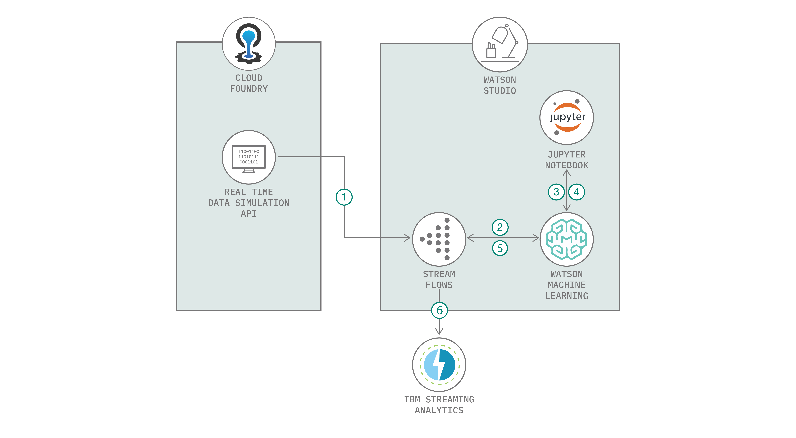
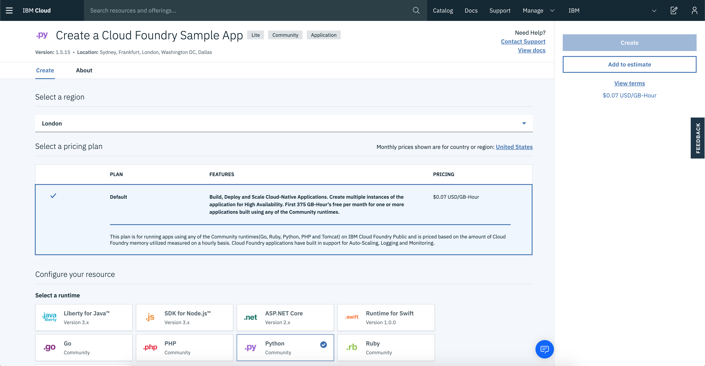
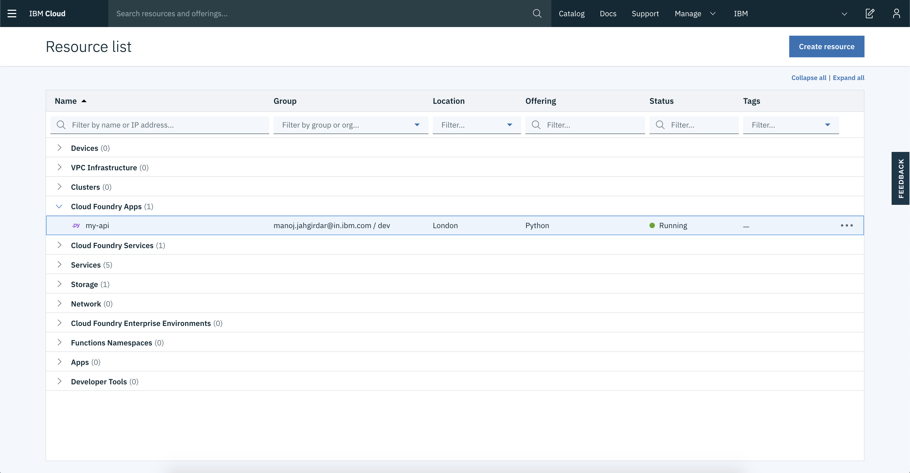
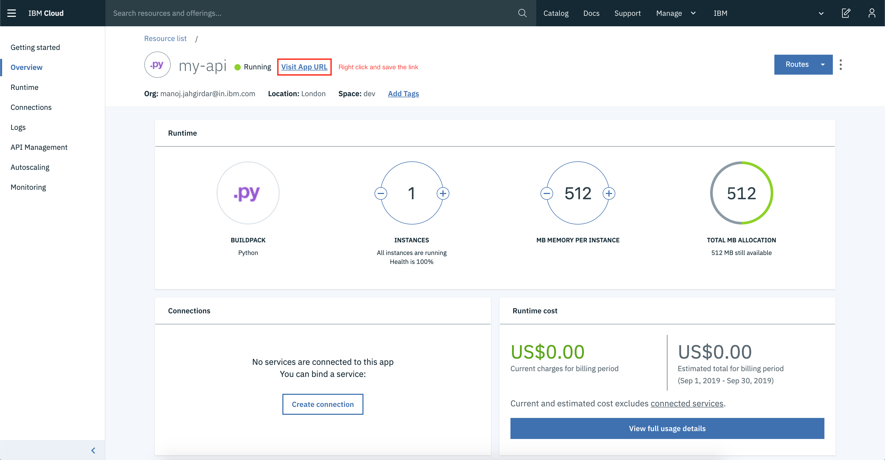
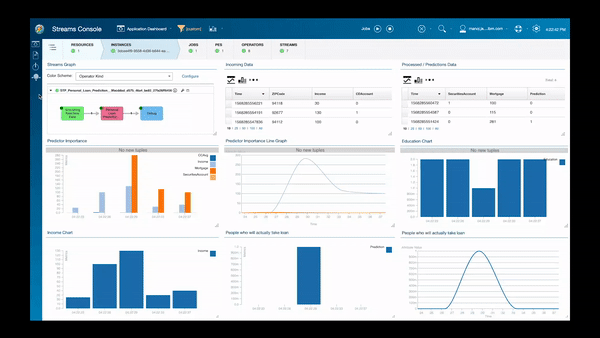

<!-- Add a new Title and fill in the blanks -->
# Live streaming and analysis of data with ML Model predictions using IBM Streaming Analytics

In this code pattern, we will create a live dashboard view of data, analyze the data and predict accordingly using IBM Streaming Analytics and Watson Studio.

Every retailer tries to sell a product to a customer but not all customers are willing to accept the product, we gather a customer-related dataset and based on that predict whether the customer will buy the product if offered. All of this will happen in real-time on a dashboard so that it helps the retailer to better understand which type of customers to target to get the maximum sales of their product.

We take the use case of a Bank selling the personal loan to its customers and predict whether the customer will accept a loan offered to them or not. We will code the Machine Learning model in a Jupyter notebook in Watson Studio and deploy the model to Watson Machine Learning. Further, we design a Streams Flow in Watson Studio that has an input node which brings in the data from various sources such as REST API calls, Stream events from a Kafka broker, IBM Event Streams, MQTT broker, Watson IoT device platform etc... which is streamed as input to the next node that is the python model invoked from Watson Machine Learning. The predictions and various features affecting the prediction are reviewed as output which is then stored in Cloud Object Storage as a CSV file. A Streaming analytics instance associated with the flow will start running as soon as the flow is deployed and live data and predictions can be monitored on the IBM Streaming Analytics dashboard in real-time.

When you have completed this code pattern, you will understand how to:

* How to deal with real-time data in IBM Streaming Analytics.
* How to design custom Stream Flows to build your own live streaming service.
* How to read any data in Streams FLow with the available nodes.
* How to create a model and deploy it to Watson Machine Learning.

<!--add an image in this path-->


<!--Optionally, add flow steps based on the architecture diagram-->
## Flow

1. Create a REST API with python and deploy it to Cloud Foundary service. Calling this API returns a json with random attribute values of the outsource dataset. Thus it simulates real-time data.
2. Create a Watson Studio instance and a Watson Machine Learning instance in IBM Cloud.
3. Create a new Jupyter notebook in Watson Studio and execute the cells to successfully train, test, get accuracy and deploy the model to Watson Machine Learning.
4. Once the Real-time data source and the machine learning model is ready the stream flow can be built. Create a new Streams Flow in Watson Studio.
5. Build a flow with input as the REST API, data processing by the deployed Watson Machine Learning model and Save the output to a csv file in Cloud Object Storage.
6. Launch the Streaming Analytics dashboard and visualize the data in real-time.

<!--Optionally, update this section when the video is created-->
## Watch the Video


## Pre-requisites
1. [IBM Cloud Account](https://cloud.ibm.com)

## Steps

1. [Clone the repo](#1-clone-the-repo).
2. [Deploy API](#2-deploy-api).
3. [Create Watson Services](#3-create-watson-services).
4. [Run the Jupyter Notebook and Deploy the ML Model](#4-run-the-jupyter-notebook-and-deploy-the-ml-model).
5. [Create IBM Streaming Analytics service](#5-create-ibm-streaming-analytics-service).
6. [Create the Streams Flow in Watson Studio](#6-create-the-streams-flow-in-watson-studio).
7. [Visualize the Streams Dashboard](#7-visualize-the-streams-dashboard).

### 1. Clone the repo

Clone the `live-streaming-of-IoT-data-using-streaming-analytics` repo locally. In a terminal, run:

```bash
$ git clone https://github.com/IBM/live-streaming-of-IoT-data-using-streaming-analytics
```

We’ll be using the file [`Data/training-testing-data.xlsx`](Data/training-testing-data.xlsx) and the folder
[`flask-API`](flask-api/).

### 2. Deploy and Test the API

In order to simulate real-time incoming data, we create an API and deploy it to Cloud Foundry.
>NOTE: IBM Streaming analytics has the following input sources: Stream events from a Kafka broker, IBM Event Streams, MQTT broker, Watson IoT device platform. If you have knowledge about any of these, then you can skip this step and create your own input block.

#### 2.1. Deploy the API and get API URL

* Create a [Cloud Foundry](https://cloud.ibm.com/catalog/starters/cloud-foundry?runtime=python) service with python runtime and follow the steps.



* You can give any app name, in our case we have given the app name as `my-api`.

* From the cloned repo, goto _`flask-api`_ directory.

```bash
$ cd flask-api/
```

* Make sure you have installed [IBM Cloud CLI](https://cloud.ibm.com/docs/cli?topic=cloud-cli-getting-started&locale=en-US) before you proceed.

* Log in to your IBM Cloud account, and select an API endpoint.
```bash
$ ibmcloud login
```

>NOTE: If you have a federated user ID, instead use the following command to log in with your single sign-on ID.
```bash
$ ibmcloud login --sso
```

* Target a Cloud Foundry org and space:
```bash
$ ibmcloud target --cf
```

* From within the _`flask-api`_ directory push your app to IBM Cloud.
```bash
$ ibmcloud cf push <YOUR_APP_NAME>
```
>Example: As our app name is `my-api` we use the following command.
```bash
$ ibmcloud cf push my-api
```

* You will see output on your terminal as shown, verify the state is _`running`_:

```
Invoking 'cf push'...

Pushing from manifest to org manoj.jahgirdar@in.ibm.com / space dev as manoj.jahgirdar@in.ibm.com...

...

Waiting for app to start...

...

  state     since                  cpu     memory           disk           details
#0   running   2019-09-17T06:22:59Z   19.5%   103.4M of 512M   343.4M of 1G
```

* Once the API is deployed and running you can test the API.

* Goto [IBM Cloud Resources](https://cloud.ibm.com/resources) and select the Deployed API, _`my-api`_ in our case. 



* Inside the _`my-api`_ dashboard, right click on **Visit App URL** and Copy the link address. 
>Example link address: https://my-api-xx-yy.eu-gb.mybluemix.net/

**NOTE: This API Link is Important, please save it in any notepad since it will be used in [step 6](#6-create-the-streams-flow-in-watson-studio).**



#### 2.2. Test the API

* To test the API use any Rest API Client like [Postman](https://www.getpostman.com/downloads/).

* Make a GET request to the earlier copied link (https://my-api-xx-yy.eu-gb.mybluemix.net) as shown.


* A Json body is returned in response which is the outsource data that can be sent to the model to get the predictions.

At this point you have successfully deployed an API.

### 3. Create Watson services

We will be using Watson studio's jupyter notebook to build and deploy the model in Watson Machine Learning service. Also to create a Watson Studio service we require a Cloud Object Storage service hence we will be creating that as well.

#### 3.1. Create Cloud Object Storage Service

* Create [**Cloud Object Storage**](https://cloud.ibm.com/catalog/services/cloud-object-storage) service.


* Thats it! your database is created at this point.

#### 3.2. Create the Watson Machine Learning Service

* Create [**Watson Machine Learning**](https://cloud.ibm.com/catalog/services/machine-learning) service.


* Once the service is created, on the landing page click on _`Service credentials`_ in the left panel and then click _`New Credential`_ and create credentials for the service as shown. 


* Click `Add` to generate credentials.


* The newly created credentials can ve viewed by clicking the **_View credentials_** and copy the credentials as shown.


**NOTE: Copy the Credentials in some notepad as it will be required in [step 4](#4-run-the-jupyter-notebook-and-deploy-the-ml-model)**

#### 3.3. Create the Watson Studio Service

* Create [**Watson Studio**](https://cloud.ibm.com/catalog/services/watson-studio) service.


* Then click on **Get Started**.

* In Watson Studio click **`Create a project > Create an empty project`** and name it **_`Streaming Analytics Demo`_**.


* Once the project is created, click on _`Add to project`_ on the top right corner and select _`Notebook`_ in the options.


* In the New Notebook page click on _`From URL`_ and enter name and the URL : **`https://github.com/IBM/live-streaming-of-IoT-data-using-streaming-analytics/blob/master/notebook/Python_Predictive_Model.ipynb`** and click _Create Notebook_ as shown.


At this point Watson Services are all setup. Now its time to code!

### 4. Run the Jupyter Notebook and Deploy the ML Model

In this session we build a Naive Bayes Model for predicting whether a customer will accept personal loan or not. The dataset is taken from Kaggle (https://www.kaggle.com/itsmesunil/bank-loan-modelling).

* Open Jupyter Notebook, under _`Files`_ click on _`browse`_ and load the `training-testing-data.xlsx` dataset from the `Data` directory which was earlier cloned.


* You will now see `training-testing-data.xlsx` on the right side panel. Click on the cell shown in the image below and insert the pandas DataFrame for the dataset as shown.


* Now you will see the credentials and the DataFrame object in the selected cell. **Replace the two lines as show**.
	


* Replace `df_data_0` to `data` and add the parameter `'Data'` to the `read_excel` method as shown.

```python3
data = pd.read_excel(body, 'Data')
data.head()
```


* Insert your Watson Machine Learning Credentials which was copied in [step 3.2](#3.2-create-the-watson-machine-learning-service) in the third cell as shown.


* Run the notebook by selecting `Cell` and `Run All` as shown.


At this point you have successfully Created an API and Deployed a Predictive model. Now we create the Streams Flow.

### 5. Create IBM Streaming Analytics service

* Create a [Streaming Analytics](https://cloud.ibm.com/catalog/services/streaming-analytics) service.


* This service will be consumed in next step.

### 6. Create the Streams Flow in Watson Studio

* Back to Watson Studio project that you created, click on _`Add to project`_ again on the top right corner and select _`Streams flow`_ in the options. 


* Enter the name as _**Predictive analytics stream flow**_ Select _`From file`_ and upload the `predictive_stream.stp` file from the `stream` directory which you have cloned. Finally select the Streaming Analytics Service that you created in [step 5](#5-create-ibm-streaming-analytics-service).


>NOTE: If you dont see the Streaming Analytics Service listed you can associate it by clicking the provided link. Checkout [TROUBLESHOOTING.md](#TROUBLESHOOTING.md) for more.

* Before you start the streams flow you need to set a couple of things. In the streams flow dashboard click on _`Edit the streams flow`_ as shown.


* In the Streams Canvas select the first block named `Simulating Real-time Data` to view its properties. In the URL field enter the API URL that you saved in [step 2.1](#2.1-deploy-the-api-and-get-api-url).


* Now click on the second block named `Python Model` to view its properties. Select the Python model deployed earlier. 


>NOTE: If you dont see the deployed model then you need to add the Watson Machine Learning service to your project manually. Checkout [TROUBLESHOOTING.md](#TROUBLESHOOTING.md) for more. 

* Finally click on `Save and run` to build and deploy the streams flow to your IBM Watson Streaming Analytics service.


* The _Build and Deploy_ will take approximately 5 - 10 min so be patient.


* You can see the realtime data flow in the Streams Flow.


### 7. Visualize the Streams Dashboard

* Once the status is **running** you can visualize the incoming data and the predicted data in IBM Watson Streaming Analytics.

* Goto [IBM Cloud Resources](https://cloud.ibm.com/resources), under Services select the _**Streaming Analytics**_ service.


* Click on **Launch** to open the Streams Dashboard.


* You can see the streams flow that we built in the Watson Studio.


* For the use case that we have considered, we will be monitoring the _**predictions**_ for the customers who will take personal loan and the _**Factors influencing the predictions**_.

* Based on the dataset we have understood that the following attributes affect the prediction:
	* Income
	* CCAvg
	* Mortgage
	* SecuritiesAccount
Hence we will be adding widgets to monitor these attributes along with the Prediction attribute.

* To add widget hover your over the arrow mark from _**Python Model**_ to _**Debug**_ and click _**Create Dashboard View**_ as shown.


* In _**Create Data Visualisation View**_ enter **View Name**: ``Monitoring Data`` and click _OK_.


* You can now see **Monitoring Data** table in your dashboard. Click on create Bar Graph Button in the table as shown.


* Enter the **Chart Name**: `Predictor Importance` and then click on ** Categories** tab and select **SecuritiesAccount**, **Mortgage**, **Income** & **CCAvg**.


* You can now see **Predictor Importance** bar graph in the dashboard.


* Similarly you can create a line graph for the same attributes as shown.


* You can now see **Predictor Importance** line graph in the dashboard.


* Now add the **Predictions** Bar Graph and Line Graph in the similar way as shown.


## Sample output



<!--Optionally, include any troubleshooting tips (driver issues, etc)-->

## Troubleshooting

* Error: Environment {GUID} is still not active, retry once status is active

  > This is common during the first run. The app tries to start before the Watson Discovery
environment is fully created. Allow a minute or two to pass. The environment should
be usable on restart. If you used **Deploy to IBM Cloud** the restart should be automatic.

* Error: Only one free environment is allowed per organization

  > To work with a free trial, a small free Watson Discovery environment is created. If you already have
a Watson Discovery environment, this will fail. If you are not using Watson Discovery, check for an old
service thay you might want to delete. Otherwise, use the `.env DISCOVERY_ENVIRONMENT_ID` to tell
the app which environment you want it to use. A collection will be created in this environment
using the default configuration.

<!-- keep this -->
## License

This code pattern is licensed under the Apache License, Version 2. Separate third-party code objects invoked within this code pattern are licensed by their respective providers pursuant to their own separate licenses. Contributions are subject to the [Developer Certificate of Origin, Version 1.1](https://developercertificate.org/) and the [Apache License, Version 2](https://www.apache.org/licenses/LICENSE-2.0.txt).

[Apache License FAQ](https://www.apache.org/foundation/license-faq.html#WhatDoesItMEAN)
